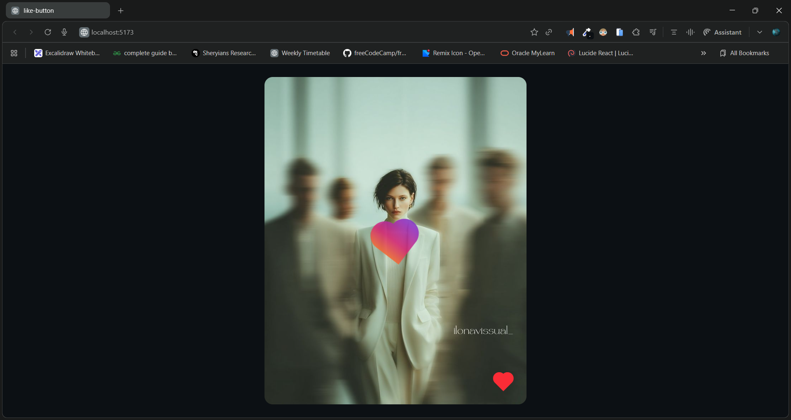

# ✅ Like Button in React

A simple **interactive Like button app built with React + Vite** - demonstrates state management and UI feedback.

Live demo: [https://react10likebtn.netlify.app/](https://react10likebtn.netlify.app/)

---

## ▶️ Demo

[Watch Demo on YouTube, Click to watch the demo video](https://youtu.be/ZIPcfTzp-zI)

---

## 🚀 About

This project shows a basic **like button UI**, built with modern React (using state) and bundled with **Vite** for fast development and build. It’s perfect as a tiny portfolio piece or practice of event handling and component state.

---

## 💡 Features

- ✅ Click the button to increment likes
- ✅ Button visually responds to interaction
- ✅ Lightweight and fast with Vite
- ✅ Easy to extend (e.g., add animations, API sync, persistent storage)

---

## 🛠️ Built With

* **React** - UI library for component-based design
* **Vite** - Lightning-fast build and dev server
* **HTML/CSS/JS** best practices

---

## 📁 Getting Started

### Clone & Run Locally

```bash
git clone https://github.com/Dileep-kumawat/Like-Button-using-React.git
cd Like-Button-using-React
npm install
npm run dev
```

Open [http://localhost:5173](http://localhost:5173) in your browser.

---

## 🧠 How It Works

The app uses React state (`useState`) to track how many times the button was clicked. When the user clicks the like icon, the number increases. You can expand the logic to save counts in localStorage or sync with a backend.

Here’s the core idea:

```js
const [likes, setLikes] = useState(0);

const handleLike = () => setLikes(likes + 1);
```

This pattern is the basis for all interactive UI in React. It’s not fancy, but it *works*, and more importantly, it’s correct and clean.

---

## 📸 Screenshot



---

## 🙌 Author

**Dileep kumawat**

- 📧 [dileepkumawat525@gmail.com](mailto:dileepkumawat525@gmail.com)
- 🔗 [LinkedIn](https://www.linkedin.com/in/dileep-kumawat/)

Feel free to connect or contribute!

---

## 🧾 License

MIT © Dileep kumawat